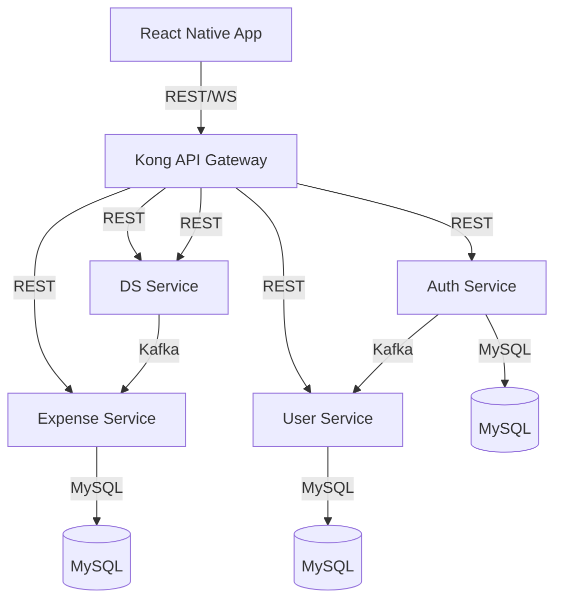

# Expense Tracker Microservices Project

## Overview

This project is a full-stack, microservices-based expense tracker application. It features:

- **React Native Frontend** for user interaction.
- **Spring Boot Microservices** for authentication, user management, and expense management.
- **Python Flask Data Science Service** for AI-powered message processing.
- **Kafka** for asynchronous inter-service communication.
- **MySQL** for persistent storage.
- **Kong API Gateway** for unified routing, authentication, and CORS.
- **Docker Compose** for orchestration.

---

## Architecture Diagram



---

## Services and Their Responsibilities

### 1. **Auth Service**
- **Tech:** Spring Boot, MySQL, Kafka
- **Responsibilities:**
  - Handles user authentication (login/signup).
  - Issues JWT tokens.
  - Publishes user events to Kafka for other services (e.g., user creation).
  - Validates credentials and manages user roles.
- **Endpoints:**
  - `/auth/v1/login` - User login
  - `/auth/v1/signup` - User registration
  - `/auth/v1/health` - Health check

### 2. **User Service**
- **Tech:** Spring Boot, MySQL, Kafka
- **Responsibilities:**
  - Manages user profiles and information.
  - Consumes user creation events from Kafka (from Auth Service).
  - Provides user data to other services.
- **Endpoints:**
  - `/user/v1/getUser` - Get user info
  - `/user/v1/health` - Health check

### 3. **Expense Service**
- **Tech:** Spring Boot, MySQL, Kafka
- **Responsibilities:**
  - Manages expense records for users.
  - Provides endpoints to add and fetch expenses.
  - Consumes expense events from Kafka (from DS Service).
- **Endpoints:**
  - `/expense/v1/getExpense` - Get all expenses for a user
  - `/expense/v1/addExpense` - Add a new expense
  - `/expense/v1/health` - Health check

### 4. **DS (Data Science) Service**
- **Tech:** Python Flask, Kafka
- **Responsibilities:**
  - Processes incoming messages (e.g., SMS) using AI/LLM (Mistral AI).
  - Determines if a message is a bank SMS and extracts expense data.
  - Publishes processed expense data to Kafka for the Expense Service.
- **Endpoints:**
  - `/ds/v1/message` - Process a message and extract expense info

### 5. **Kong API Gateway**
- **Tech:** Kong, Lua (custom plugins)
- **Responsibilities:**
  - Central entry point for all frontend requests.
  - Handles authentication (JWT validation via custom plugin).
  - Routes requests to the appropriate backend service.
  - Manages CORS and logging.

### 6. **Kafka**
- **Tech:** Confluent Kafka, Zookeeper
- **Responsibilities:**
  - Asynchronous event bus for inter-service communication.
  - Used for user creation and expense processing events.

### 7. **MySQL**
- **Tech:** MySQL 8
- **Responsibilities:**
  - Persistent storage for users, authentication, and expenses.
  - Each service has its own database schema.

---

## How the Services Work Together

1. **User Signup/Login:**
   - User signs up or logs in via the React Native app.
   - Auth Service authenticates and issues a JWT.
   - On signup, Auth Service publishes a user creation event to Kafka.
   - User Service consumes this event and creates a user profile.

2. **Expense Addition (Manual or via SMS/AI):**
   - User adds an expense manually via the app, or sends a message (e.g., SMS).
   - For SMS, the message is sent to the DS Service via Kong.
   - DS Service uses AI to extract expense info and publishes it to Kafka.
   - Expense Service consumes the event and stores the expense in MySQL.

3. **Fetching Expenses:**
   - The app requests expenses via Kong.
   - Kong authenticates and routes the request to the Expense Service.
   - Expense Service fetches expenses from MySQL and returns them.

4. **Real-Time Updates (WebSocket, if enabled):**
   - When a new expense is added, the backend can notify the frontend via WebSocket for instant UI updates.

---

## Running the Application

### 1. Start All Services

```sh
docker-compose up -d
```

### 2. Build and Run the Frontend

```sh
cd frontend/expensetrackerapp
npm install
# For Android:
npx react-native run-android
# For iOS:
npx react-native run-ios
```

### 3. Test the Setup

- Kong Gateway: http://localhost:8000
- Auth Service Health: http://localhost:8000/auth/v1/health
- Expense Service Health: http://localhost:8000/expense/v1/health

---

## Authentication Flow

1. User logs in via the app.
2. Auth Service returns a JWT.
3. App stores the JWT in AsyncStorage.
4. All subsequent API calls include the JWT in the Authorization header.
5. Kong validates the JWT and forwards the request to the correct service.

---

## Database Setup

- The application auto-creates the following databases:
  - `authservice`
  - `userservice`
  - `expenseservice`

---

## Development Notes

- All services use environment variables for configuration.
- Kafka topics are auto-created.
- JWT tokens have configurable expiration.
- The DS service uses Mistral AI for message processing.
- Kong handles CORS and authentication centrally.

---

## Troubleshooting

- **Port conflicts:** Ensure ports 8000, 3306, etc. are available.
- **Docker build issues:** Run `docker-compose build --no-cache`.
- **Database connection:** Wait for MySQL to fully start before other services.
- **Kafka connection:** Ensure Zookeeper starts before Kafka.

### Logs

```sh
# View all logs:
docker-compose logs -f

# View specific service logs:
docker-compose logs -f authservice
docker-compose logs -f kong-service
```

---

## Contributing

1. Fork the repo
2. Create a feature branch
3. Commit your changes
4. Open a pull request

---